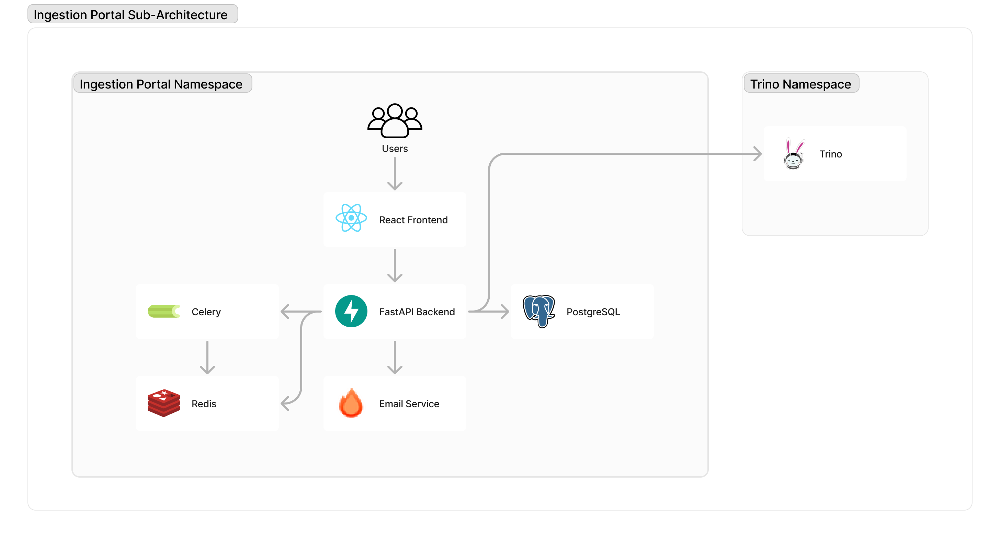

# Architecture

## Backend

### Framework

The application uses [FastAPI](https://fastapi.tiangolo.com/) as the backend framework
and PostgreSQL as the database which essentially serves as the file uploads metastore.
This is used to keep track of other aspects of the portal such as approval requests,
deletion requests, and API ingestion configurations. Other notable software used in the
backend stack are:

- [SQLAlchemy](https://www.sqlalchemy.org/) to interact with the database
- [Alembic](https://alembic.sqlalchemy.org/en/latest/) to handle database migrations
- [Pydantic](https://docs.pydantic.dev/latest/) for data modeling and validation

### Email Service

The service used to generate and render emails is decoupled from the main backend
service. For this, a lightweight [Hono](https://hono.dev/) server is used, which in
turn, makes calls to [React Email](https://react.email/) to render the emails as both
HTML and plaintext.

### Trino connector

A Trino connector also backed by SQLAlchemy is used to query the Trino service. This is
primarily used for retrieving the current version of the school geolocation and coverage
schemas.

### Redis/Celery

Redis is used as both a cache and a task queue/broker for Celery. The main cached items
are the schemas, which is used heavily for the column mapping feature in the frontend.
Celery runs a periodic tasks to refresh the cache.

## Frontend

### Routing

This project
uses [TanStack Router's](https://tanstack.com/router/latest/docs/framework/react/guide/file-based-routing)
file-based routing for our routing needs.

### Context Store

This project uses [Zustand](https://docs.pmnd.rs/zustand/getting-started/introduction)
for managing global state. We use a single store located in the `src/context/store.ts`
file and split into multiple smaller stores using
Zustand's [slices pattern](https://docs.pmnd.rs/zustand/guides/slices-pattern).

### UI Library and Styling

[Carbon Design System](https://carbondesignsystem.com/) is the preferred library of
choice since it is what Giga's Brand and UI design guide is based on. As a developer,
you will be referencing Carbon's official
[React Storybook](https://react.carbondesignsystem.com/) page often when trying to pick
out components to use for future features.

For styling, we use [TailwindCSS](https://tailwindcss.com/). If you need to override
styles of some elements of the Carbon Library, you can use the classic CSS approach of
adding/looking for the classnames held by these components and modifying their styles
directly via the `carbon.scss` file.

### Authentication

Both backend and frontend routes are protected by Azure AD B2C authentication.
Role-based access control (RBAC) is handled in-app. Generally, Admin users have full
authorization on all actions, while Regular users can only perform basic tasks
like uploads for specific country-dataset combinations.
