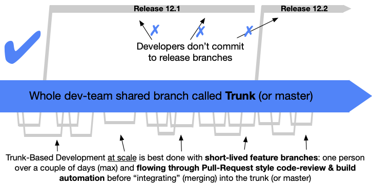

# Development Lifecycle

## Trunk Based Development



The Giga DataOps Platform project follows the concept of Trunk-Based Development,
wherein User Stories are worked on PRs. PRs then get merged to `main` once approved by
another developer.

The `main` branch serves as the most up-to-date version of the code base.

### Naming Conventions

#### Branch Names

Refer to [Conventional Commits](https://www.conventionalcommits.org/en/v1.0.0/).

#### PR Title

`[<Feature/Fix/Release/Hotfix>](<issue-id>) <Short desc>`

#### PR Template

[pull_request_template.md](../.github/pull_request_template.md)

### Development Workflow

- Branch off from `main` to ensure you get the latest code.
- Name your branch according to the Naming Conventions.
- Keep your commits self-contained and your PRs small and tailored to a specific feature
  as much as possible.
- Push your commits, open a PR and fill in the PR template.
- Request a review from 1 other developer.
- Once approved, rebase/squash your commits into `main`. Rule of thumb:
    - If the PR contains 1 or 2 commits, perform a **Rebase**.
    - If the PR contains several commits that build toward a larger feature, perform a
      **Squash**.
    - If the PR contains several commits that are relatively unrelated (e.g., an
      assortment of bug fixes), perform a **Rebase**.

## Local Development

> 📖 **For detailed setup instructions**, including step-by-step configuration, troubleshooting,
> and granting admin permissions, see the [Local Development Guide](local-development.md).

### File Structure Walkthrough

- `azure/` - Contains all configuration for Azure DevOps pipelines.
- `api/` - Contains all custom backend API code.
- `docs/` - This folder contains all Markdown files for documentation.
- `email/` - Contains all custom email API code.
- `infra/` - Contains all Kubernetes & Helm configuration.
- `ui/` - Contains all custom frontend code.

### Pre-requisites

#### Required

- [ ] [Docker](https://docs.docker.com/engine/)
- [ ] [Task](https://taskfile.dev/installation/#install-script)
- [ ] [asdf](https://asdf-vm.com/guide/getting-started.html)
- [ ] [Poetry](https://python-poetry.org/docs/#installation)
- [ ] [Python 3.11](https://www.python.org/downloads/)
- [ ] [Node 20](https://nodejs.org)

#### As-needed

- [ ] [Kubernetes](https://kubernetes.io/docs/tasks/tools/)
    - If you are using Docker Desktop on Windows, you can use the bundled Kubernetes
      distribution.
- [ ] [Helm](https://helm.sh/docs/intro/install/)

Refer to the Development section in the docs
of [unicef/giga-dagster](https://github.com/unicef/giga-dagster/blob/main/docs/development.md#local-development).

Additional setup:

#### Node

1. Install Node
    ```shell
    asdf add plugin nodejs
    asdf install nodejs 20.10.0
    ```
2. Update package manager
   ```shell
   npm i -g npm
   ```

### Cloning and Installation

1. `git clone` the repository to your workstation.
2. Run initial setup:
    ```shell
    task setup
    ```

### Environment Setup

**API**, and **UI** have their own respective `.env` files. The
contents of these files can be provided upon request. There are also `.env.example`
files which you can use as reference. Copy the contents of this file into a new file
named `.env` in the same directory, then supply your own values.

> 📖 **For detailed environment configuration instructions**, including Azure B2C setup and
> database configuration, see the [Local Development Guide](local-development.md).

Ensure that the Pre-requisites have already been set up and all the necessary
command-line executables are in your `PATH`.

### Running the Application

```shell
# spin up Docker containers
task

# Follow Docker logs
task logs

# List all tasks (inspect Taskfile.yml to see the actual commands being run)
task -l
```

#### Housekeeping

At the end of your development tasks, stop the containers to free resources:

```shell
task stop
```
